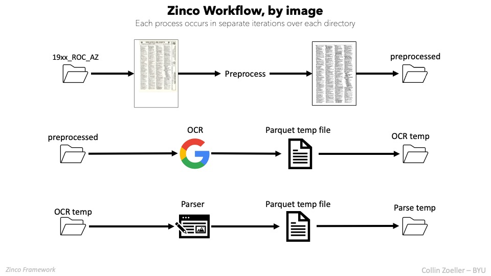

# ZincoML
This is a brand-new update of the Zinco framework utilizing the foremost in artificial 
intelligence to read and tabular-ize data retained in unstructured images of scanned city directories.

## What is the ML?
This projects builds on the previous framework by incorporating image segmentation and NLP, in addition to OCR,
to quickly and efficiently extract the information from the city directories. The previous framework was built on a
primarily rules-based approach which, while effective, suffered from a lack of flexibility and scalability beyond the
residential listings. Tests for business directories varies in success, and variations in the format of the directory
over time and across cities made it difficult to create a single rules-based approach that could be applied to every case.
ZincoML solves this problem by using a machine learning approach to extract the information from the images. It is robust 
to every year in the dataset and can be applied to any city directory given the proper training data. 

ML also simplifies the process significantly. There is little preprocessing required, much less overhead, and the pipe 
is essentially reduced to 3 steps:
1. Image Segmentation to identify the relevant text field (via custom-tuned YOLOv8 model)
2. OCR to extract the text from the image (via Tesseract)
3. NLP to parse the text into a tabular format (via Spacy integration with LLMs, specifically Google's Palm AI)

With geocoding as an additional post-processing option. 

***Below shows the pipeline for the ML approach though written for th rules-based approach. Will be updated in time.*** 

## Background
**Zinco** calls to mind the zinc plates used in the early 19th century during the advent of zincography as a precursor 
to modern lithography and photography. These plates would be used to create etched images through a process of 
chemical reactions with various inks and salts. These are often our oldest windows into the past. 

It is a fitting name for our purposes in developing now digital images
representing historical information in a novel field. We don't use zincos anymore, but **zinco** may as well be a 
precursor for other OCR tools in the near future to create new windows into the past using data analysis. 

## Data
The current study divides the data into two categories: **Business** and **Alphabetical** directories.
**Alphabetical** directories are organized by last name and are not exclusively residential listings. 

**Business** records are organized by business type and are exclusively commercial listings.
Image folders are inputted and CSVs are outputted containing
information of businesses including:
1. Business type (i.e. advertising, mechanic)
2. Name of business
3. business contact: address, phone number,etc
4. other text included in the directory

Zinco has been tested and validated on the R.L. Polk & Co. directories from 1879 to 2010 in the Rochester, NY area, with 
some testing on Greensborough NC. While these directories are normally available as a paper copy public record in 
public libraries, you can contact one of the authors for access to the digital images.

## Pipeline Overview
The concept is very simple: Zinco leverages Google Tesseract OCR to extract text from the city directory images and 
then parses the text into a CSV file, and includes capabilities for geocoding the addresses. below is a diagram of the 
specific process. 

Extraction occurs in 3 steps for each image:
1. **Preprocessing** - Image is converted to grayscale, resized, and cropped to the body text.
2. **OCR** - Text is extracted from the image using Tesseract OCR.
3. **Parsing** - Text is parsed into a CSV file.
   
Each of 1-3 occur independently, so every image is preprocessed before OCR, and every image is OCR'd before parsing.
This also allows for the user to run each step independently, which is useful for debugging and testing. You can start
and stop the process at any point and pick up where you left off by setting `rerun=False` in the `alpha()` function.

Preprocessing consists of converting the image to grayscale, resizing it to a standard size, cropping out the ads, 
and adjusting any skew. Once this is done, Zinco will iterate through the preprocessed images and apply the OCR, 
outputting a temporary parquet file containing the OCR data. Parquet is significantly smaller than CSV encoding, 
so it uses substantially less space while retaining important metadata. It has the downside of being unable to be opened 
or viewed except through certain Python packages (so you have to view it in IDE instead of in Excel or similar 
application). Everything is done **image-wise**, so each image receives its own OCR and parse file.

Zinco then iterates over the OCR temporary files and applies a vectorized parser (does all data in a column 
simultaneously) that is really just a clever regex pipe. This separates the data into important elements, as follows

Each element category has its own column. We get a tabular data frame that looks like this:

Once all of the OCR files for a year have been parsed, Zinco combines all of the data for that year together and outputs
a `.csv`, `.dta`, and `.feather` file. **Feather** is similar to **Parquet**, except it takes up even less size and
is only suitable
for short-term data storage. I use it as a temporary backup just in case there is a problem in creating the CSV or .dta 
(such as file corruption upon writing), or if the resulting data frame in either format is too large to load in Stata 
or Pandas. 

Addresses are manually validated to make sure street numbers aren’t cut off and the addresses don’t include extra 
information like data from the next line. 
Address preparation and imputation refer to creating a full address string that can be geocoded based on the
data provided. This means stringing together the street address, city or municipality (coded with an abbreviation), 
and state. As it turns out, this is really important to yield accurate coordinates and reduce the calls to the **ArcGIS** 
geocoder (described below).     

The geocoding and mapping pipeline visualizes the results and considers in-cluster corrections of distance 
and position at Eastman Kodak. You can geocode either through ArcGIS, or the in-house geocoder. The in-house geocoder
uses a vectorized version of the Google Maps API, so you will need to have a Google Maps API key. You can choose from 
simply geocoding, or validating the address as well (address validation is significantly more expensive). 

Alternatively, if your organization has an Esri license, you can use the ArcGIS geocoder. This is a much more powerful
and ArcGIS has tools for ML clustering, spatial econometrics, and graphical visualizations.
The following shows a pipeline that is a world more efficient for big data management, primarily because 
it utilizes SQL for data storage instead of data frames. 

The point is to autocomplete geocoding information for addresses that we keep throughout the time series.
For example, there is no point in geocoding 123 Fake St, Rochester, NY, 12 separate times (or the number of years in 
the current study) if we can get it once and propagate it to future occurrences. Zinco uses a 100% score 
because anything less always has an error that prevents address matching with a new dataset.

## Navigation
The main script for the alphaveticals is `alpha.py`, which is the script that runs the entire Alpha pipeline. 
You can call its `alpha()` 
function which has the following properties:

        alpha(year_city_type_list, 
              type_path=None, 
              out_to='both',
              debug=False, 
              rerun=False, 
              step=None, 
              alert=True)` 

    :param type_path = path to parent directory of image_city_type directories (AZ or BiZ)
    :param year_city_type_list = list of year_city_type directories to be processed
    :param out_to ='csv' or 'stata' (for .dta file) or 'both', which saves the output to the specified format(s)
    :param debug: if True, saves intermediate files to debug folder
    :param rerun: = True to redo the entire directory. =False to skip over pages that have already been processed.
    :param step: str()
                 =None to run all steps.
                 ='preprocess' to run only preprocessing.
                 ='ocr' to run only ocr.
                 ='parse' to run only parsing.
                 ='aggregate' to run only aggregation.
    :return: DataFrame of parse information. Saves output to directory.

 
### To Use This Repository
Please fork this repo and subscribe to notifications as this is a working repository and will continually be updated.
You can also perform an HTTPS clone from this repository, which in most IDEs allows you to update your code by clicking
the "Pull" option under a Git or VCS tab. 
As updates come, you should be notified and able to pull updates via git or via your IDE. Please remember this code 
is currently proprietary and use or dissemination of any kind must first be approved by the author(s) and researcher.

**To Cite this Work:**

*When using this code, please cite the authors' name and school affiliation.*
          
         Title: Zinco Directory Conversion
         Authors: Zoeller, C and Christensen, J. Brigham Young University
         Date: 2022
         Version: {version}
         Availability: contact zoellercollin@gmail.com

    
   
   Zoeller, C and Allen, N. *Brigham Young University.* (2022) Zinco Directory Conversion {version} {Source code}.

### Creating the Environment

***Note:***
*This code does not work in Google Colab because of some functionalities in CV2 and the directory creations involved.
You will need to use an IDE and configure the environment as described below*

This project was created and revised using the Anaconda distribution with the JetBrains data science IDE DataSpell. 
The Pytesseract wrapper package is available in either PIP or Conda but requires the actual OCR API, Tesseract,
to function. [Visit the documentation](https://tesseract-ocr.github.io/tessdoc/Installation.html) for detailed 
information and instructions for your specific system. Package managers such as Home Brew on macOS are helpful. You will 
then call something similar to following in the terminal:

      $ brew install tesseract
If you run the code at this point, you will likely receive
      
      ERROR[13]: PERMISSION DENIED
Which can be solved by giving Tesseract root access by calling

      $ chmod +x <pathway_to_module_script>

#### Additional Resources
[Chmod commands](
https://www.cyberciti.biz/faq/how-to-use-chmod-and-chown-command/)   
[Blog on Running Files as Root](
https://esmithy.net/2015/05/05/rundebug-as-root-in-pycharm/)  
[StackOverflow Error \[13\] Troubleshooting](
https://stackoverflow.com/questions/39658864/pycharm-error-errno-13-permission-denied)

Please see the handbook for detailed instructions for setting the environment, running the code, and the 
project as a whole.

Kind regards,

Collin Zoeller
***

*This repository has been prepared for the dissertation of Jonothan Palmer, Harvard Business School*

***Authorship attributions:***
*Collin Zoeller, and Josh Christensen, both of Brigham Young University,
under the direction of Jonathon Palmer, Harvard Business School.*

 Zoeller, C and Christensen, J. *Brigham Young University.* (2022) Zinco Directory Conversion {Version} [Source code].

Please direct all inquiries to [zoellercollin@gmail.com](mailto:zoellercollin@gmail.com)
###### 2020-2023 BYU RECORD LINKING LAB
***
